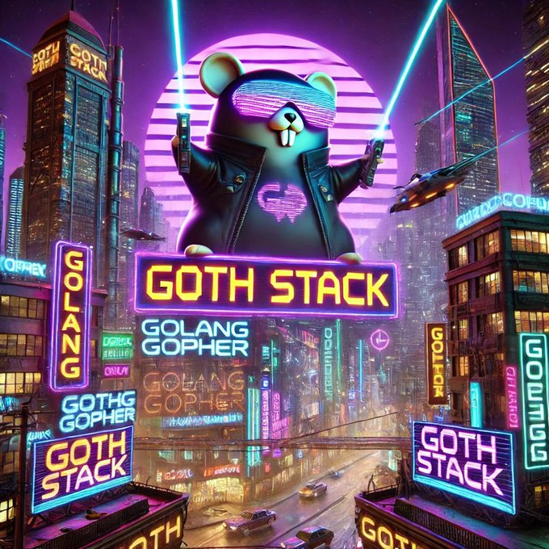

# GOTH

Go + Templ + TailwindCSS (and even bootstrap) + HTMX starter code



## Setup

```sh
cp .env.example .env
docker compose up -d postgres
make db-migrate-run
make db-create-superuser
```

For tailwind version run `make run-app` and for bootstrap 5.3 version run `make run-admin`

## Notes

- I'm not sure I like templ and tailwindcss, but it's really popular tools. In real app I used Go template + Bootstrap 5.3 version. I kept templ + tailwindcss version as separate app.
- Repo was created for reference and for private usage as starter-kit.
- It has more library code than business-logic code because it was extracted from production app.
- Some code may be broken.
- All code needed for app build is vendored, cli tools are not vendored.
- Apps builds as a single binaries, assets are baked into binaries.
- Frontend libs and templates are separate for each app.
- Includes DB tools like migrations, template for writing storage tests and etc.
- Includes CLI tool example and several commands using Cobra. Heavy framework but I like it.
- Uses modern go 1.22 std libs.

Now Go and create your own full-stack framework. Or use Django.
